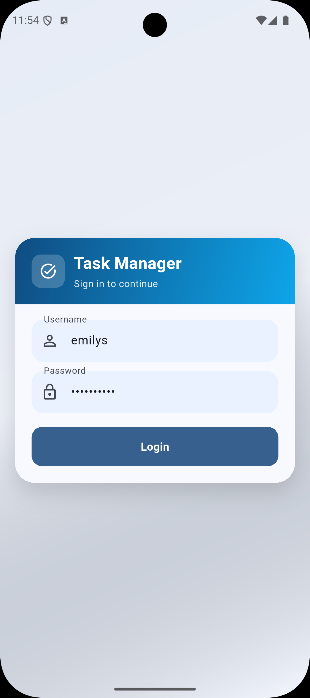
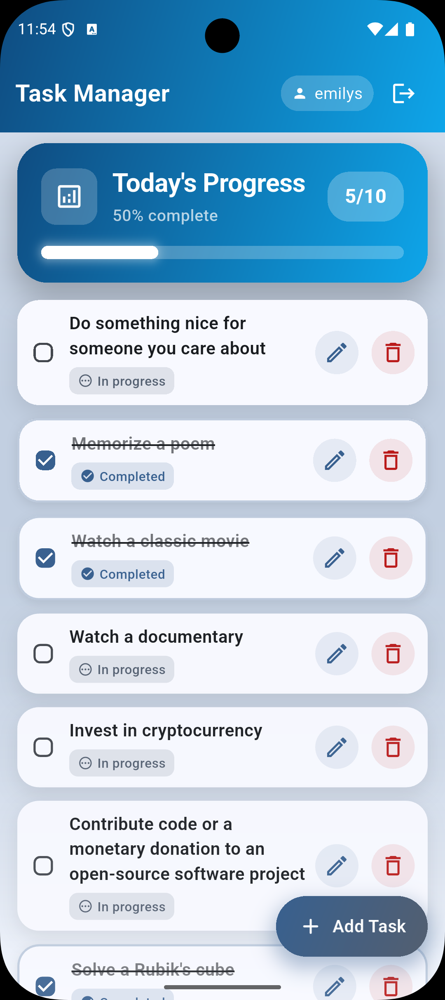
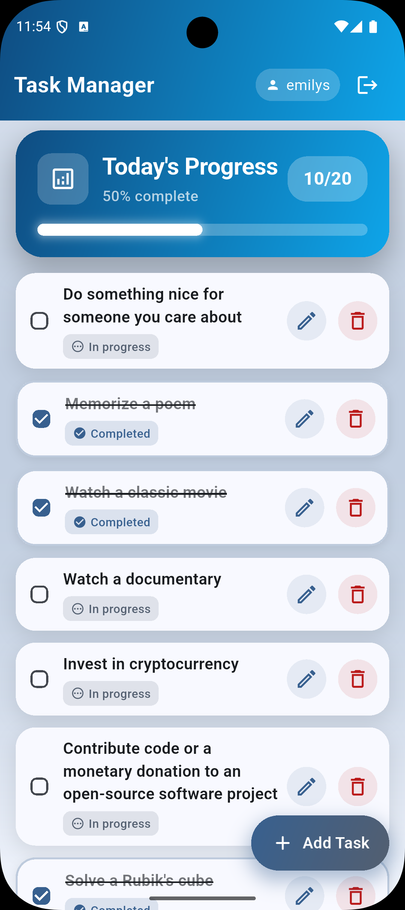
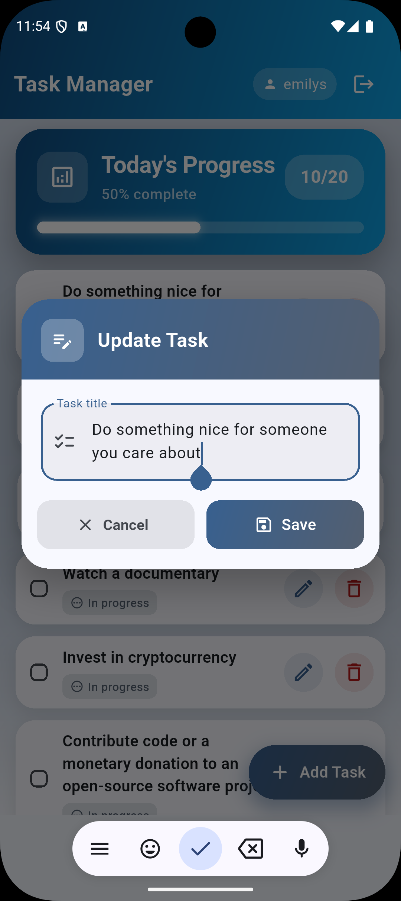
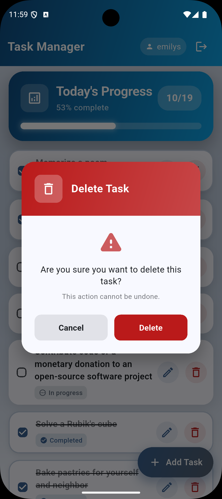
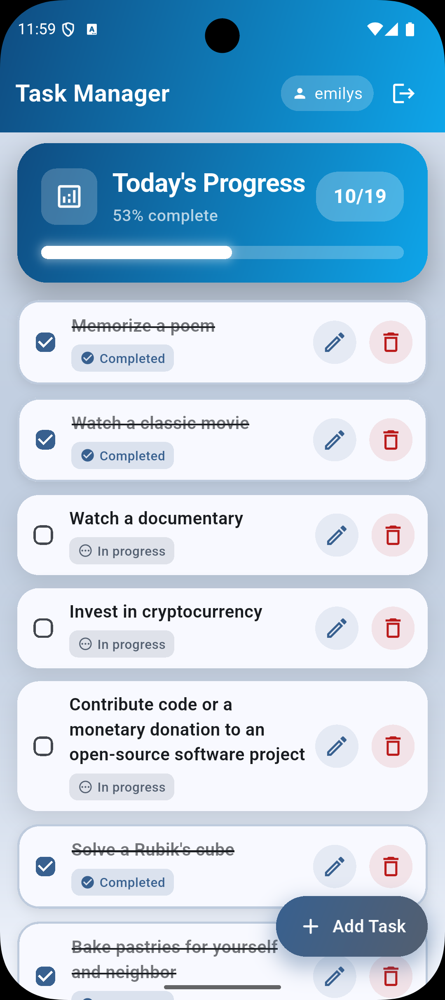

# Task Manager App

A modern, feature-rich task management application built with Flutter, featuring a clean UI with smooth animations, secure authentication, and offline support.

**🔗 Repository:** [https://github.com/stackmasteraliza/flutter_task_manager](https://github.com/stackmasteraliza/flutter_task_manager)

## Screenshots

<div align="center">
  
  
  
</div>

<div align="center">
  
  
  
</div>

## Download APK

A pre-built release APK is available for direct installation on Android devices:

**📦 APK Location:** `build/app/outputs/flutter-apk/app-release.apk`

**File Size:** ~48MB

To install the APK on your Android device:
1. Transfer the APK file to your Android device
2. Enable "Install from Unknown Sources" in your device settings
3. Open the APK file and follow the installation prompts

Alternatively, you can build the APK yourself by following the instructions in the [Build for Release](#5-build-for-release) section.

## Features

### ✨ Core Features
- **Secure Authentication** - Login with username/password via DummyJSON API
- **Session Persistence** - Secure token storage using `flutter_secure_storage`
- **Task Management** - Full CRUD operations (Create, Read, Update, Delete)
- **Task Status** - Mark tasks as completed/in-progress
- **Infinite Scroll** - Paginated task loading for optimal performance
- **Offline Support** - Local task caching with `SharedPreferences`
- **Confirmation Dialogs** - Safe delete and logout confirmations

### 🎨 UI/UX Features
- **Modern Design** - Clean, gradient-based UI with Material Design 3
- **Smooth Animations** - Fade-in, slide-in, and scale transitions
- **Interactive Feedback** - Touch animations and visual responses
- **Progress Tracking** - Animated progress card with percentage display
- **Light/Dark Mode** - Theme support ready
- **Empty States** - Beautiful empty state designs
- **Pull to Refresh** - Refresh task list with pull gesture

### 🏗️ Technical Features
- **Clean Architecture** - Separation of concerns with data/domain/presentation layers
- **State Management** - BLoC pattern (Cubit for auth, BLoC for tasks)
- **Dependency Injection** - `get_it` for service location
- **Type Safety** - Strong typing with Dart
- **Error Handling** - Centralized error management
- **Network Retry Logic** - Automatic retry for failed requests

## Tech Stack

- **Framework:** Flutter 3.38.7
- **Language:** Dart 3.10.7
- **State Management:** `bloc`, `flutter_bloc`
- **Routing:** `go_router`
- **Networking:** `dio`
- **Dependency Injection:** `get_it`
- **Secure Storage:** `flutter_secure_storage`
- **Local Persistence:** `shared_preferences`
- **Testing:** `flutter_test`, `bloc_test`, `mocktail`

## Prerequisites

Before you begin, ensure you have the following installed:

- **Flutter SDK**: Version 3.38.7 or higher
  - Download from [flutter.dev](https://flutter.dev/docs/get-started/install)
- **Dart SDK**: Version 3.10.7 or higher (included with Flutter)
- **Android Studio** / **Xcode** (for Android/iOS development)
- **Git**: For cloning the repository

### Platform-Specific Requirements

#### For Android:
- Android SDK (API level 21 or higher)
- Android Emulator or physical device
- Java Development Kit (JDK) 21 or higher

#### For iOS:
- macOS (required for iOS development)
- Xcode 26.2 or higher
- CocoaPods
- iOS Simulator or physical device

## Installation

### 1. Clone the Repository

```bash
git clone https://github.com/stackmasteraliza/flutter_task_manager.git
cd flutter_task_manager
```

### 2. Install Dependencies

```bash
flutter pub get
```

### 3. Verify Flutter Installation

```bash
flutter doctor
```

Make sure all checkmarks are green. If not, follow the instructions provided by `flutter doctor` to resolve any issues.

### 4. Run the App

#### On Android:
```bash
# List available devices
flutter devices

# Run on connected device/emulator
flutter run

# Or specify device
flutter run -d <device-id>
```

#### On iOS:
```bash
# Open iOS Simulator
open -a Simulator

# Run on iOS
flutter run
```

#### On Web:
```bash
flutter run -d chrome
```

### 5. Build for Release

#### Android APK:
```bash
flutter build apk --release
```
Output: `build/app/outputs/flutter-apk/app-release.apk`

#### Android App Bundle:
```bash
flutter build appbundle --release
```
Output: `build/app/outputs/bundle/release/app-release.aab`

#### iOS:
```bash
flutter build ios --release
```

## Project Structure

```
lib/
├── app/                          # App configuration
│   ├── app_router.dart          # Route definitions
│   └── task_manager_app.dart   # Main app widget
├── core/                         # Core utilities
│   ├── errors/                  # Error handling
│   ├── network/                 # Network client
│   ├── storage/                 # Storage services
│   ├── theme/                   # App theming
│   ├── utils/                   # Validators & utilities
│   └── widgets/                 # Reusable widgets
├── di/                          # Dependency injection
│   └── injection.dart          # Service locator setup
└── features/                    # Feature modules
    ├── auth/                    # Authentication
    │   ├── data/               # Data sources & repositories
    │   ├── domain/             # Entities & use cases
    │   └── presentation/       # UI & state management
    └── tasks/                   # Task management
        ├── data/
        ├── domain/
        └── presentation/
```

## Test Credentials

Use these credentials to login (DummyJSON test API):

- **Username:** `emilys`
- **Password:** `emilyspass`

Other test users available at: [dummyjson.com/users](https://dummyjson.com/users)

## Running Tests

```bash
# Run all tests
flutter test

# Run tests with coverage
flutter test --coverage

# Run specific test file
flutter test test/path/to/test_file.dart
```

## Architecture

### Clean Architecture Layers

1. **Presentation Layer**
   - UI components (pages, widgets)
   - State management (Cubit/BLoC)
   - User input handling

2. **Domain Layer**
   - Business logic
   - Entities
   - Use cases
   - Repository interfaces

3. **Data Layer**
   - Repository implementations
   - Data sources (remote & local)
   - Data models
   - API clients

### State Management

- **AuthCubit** - Simple state transitions for authentication
- **TasksBloc** - Event-driven architecture for complex task operations
- Both use immutable states with `Equatable`
- Clear separation of events and states

## API Integration

This app uses the [DummyJSON API](https://dummyjson.com):

- **Auth Endpoint:** `POST /auth/login`
- **Tasks Endpoint:** `GET /todos`
- **CRUD Operations:** POST, PUT, DELETE `/todos/:id`

## Configuration

### Android Permissions

The app requires internet permission, configured in:
```xml
android/app/src/main/AndroidManifest.xml
```

### iOS Info.plist

Network permissions are configured in:
```
ios/Runner/Info.plist
```

## Troubleshooting

### Common Issues

**Issue:** "Network is slow. Please try again."
- **Solution:** Check your internet connection and try again

**Issue:** Android emulator has no internet
- **Solution:**
  1. Cold boot the emulator
  2. Check emulator's network settings
  3. Try: `emulator -avd <avd_name> -dns-server 8.8.8.8`

**Issue:** Build fails on iOS
- **Solution:**
  1. Run `cd ios && pod install`
  2. Clean build: `flutter clean && flutter pub get`

**Issue:** Hot reload not working
- **Solution:** Stop the app and run `flutter run` again

## Performance Tips

1. **Enable Release Mode** for production builds
2. **Use `--split-debug-info`** for smaller APK size
3. **Enable code shrinking** in Android
4. **Optimize images** before adding to assets

## Contributing

1. Fork the repository
2. Create your feature branch (`git checkout -b feature/amazing-feature`)
3. Commit your changes (`git commit -m 'Add some amazing feature'`)
4. Push to the branch (`git push origin feature/amazing-feature`)
5. Open a Pull Request

## Code Style

This project follows the [Effective Dart](https://dart.dev/guides/language/effective-dart) style guide.

Run linter:
```bash
flutter analyze
```

Format code:
```bash
dart format .
```

## Future Enhancements

- [ ] Widget/Integration tests for complete flows
- [ ] SQLite database for advanced offline support
- [ ] Refresh token handling
- [ ] Push notifications for task reminders
- [ ] Task categories and tags
- [ ] Search and filter functionality
- [ ] Task sharing capabilities
- [ ] CI/CD pipeline setup
- [ ] Analytics integration

## License

This project is licensed under the MIT License - see the LICENSE file for details.

## Acknowledgments

- [DummyJSON](https://dummyjson.com) for the free API
- [Flutter](https://flutter.dev) team for the amazing framework
- [BLoC Library](https://bloclibrary.dev) for state management

## Contact

For questions or support, please open an issue in the repository.

---

**Built with ❤️ using Flutter**
